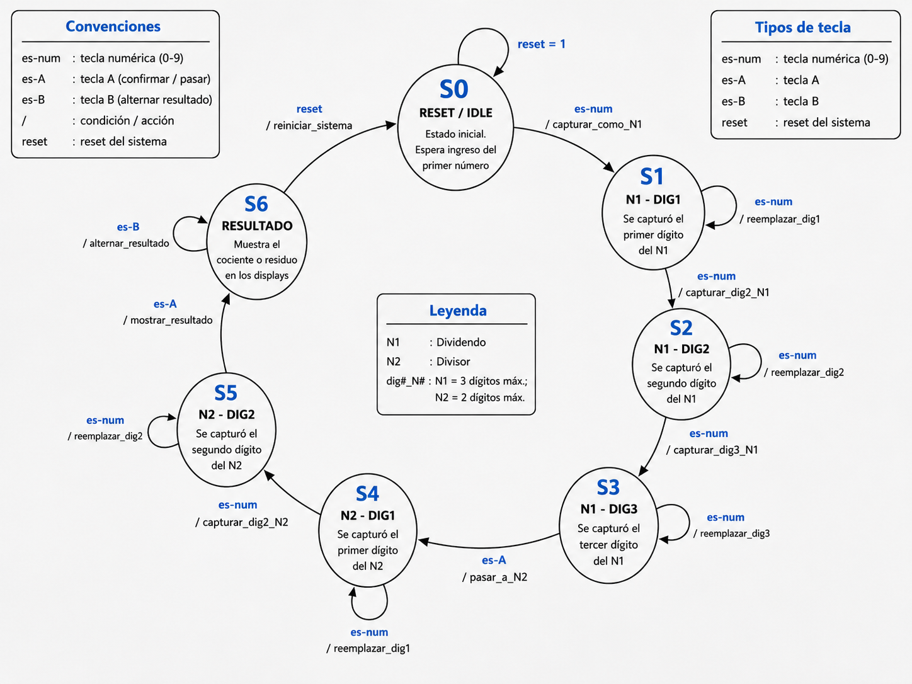
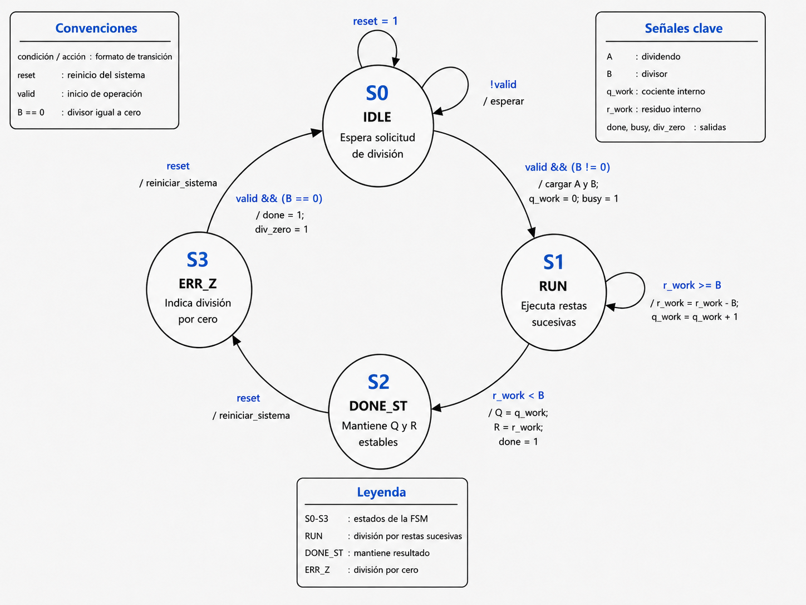
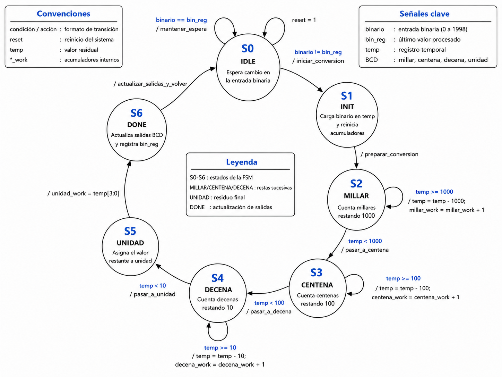

# Proyecto 3

# Sistema de división entera por teclado matricial hexadecimal

## 1. Abreviaturas y definiciones

* **FPGA**: *Field Programmable Gate Array*.
* **FSM**: Máquina de estados finitos.
* **BCD**: *Binary Coded Decimal*.
* **Q**: Cociente de la división entera.
* **R**: Residuo de la división entera.
* **Dividendo**: Número que se desea dividir.
* **Divisor**: Número por el cual se divide el dividendo.

## 2. Referencias

[0] David Harris y Sarah Harris. *Digital Design and Computer Architecture. RISC-V Edition.* Morgan Kaufmann, 2022. ISBN: 978-0-12-820064-3.


[1] Datasheet del dispositivo FPGA utilizado en la implementación.

[2] Documentación del teclado matricial hexadecimal 4x4 utilizado en la práctica.

[3] Documentación del display de siete segmentos utilizado en la práctica.

---

## 3. Funcionamiento general del circuito

El sistema diseñado corresponde a un divisor entero sin signo implementado en hardware digital sobre una FPGA. La entrada de datos se realiza mediante un teclado matricial hexadecimal 4x4. El sistema permite ingresar dos operandos decimales de hasta tres dígitos: el primer número corresponde al dividendo y el segundo al divisor.

La lectura del teclado se realiza por medio de un módulo de escaneo, el cual activa una columna a la vez y observa las filas del teclado. Debido a que las teclas mecánicas pueden producir rebotes, la señal detectada pasa por un módulo de eliminación de rebotes. Este módulo genera un único pulso limpio por cada pulsación válida.

La lógica de captura está controlada por una máquina de estados finitos. Esta FSM administra el ingreso del dividendo, el ingreso del divisor y la confirmación mediante la tecla `A`. Una vez confirmado el divisor, se activa la señal `valid_div`, que inicia la operación en el módulo divisor.

El divisor entero trabaja mediante restas sucesivas. Internamente carga el dividendo como residuo temporal y resta el divisor mientras el residuo sea mayor o igual que el divisor. Cada resta incrementa el cociente interno. Cuando el residuo queda menor que el divisor, el módulo finaliza la operación y entrega el cociente `Q` y el residuo `R`.

El resultado mostrado en el display puede alternarse con la tecla `B`. Por defecto se muestra el cociente. Al presionar `B` en el estado de resultado, el sistema cambia entre cociente y residuo. Si se detecta una división entre cero, el sistema muestra una condición de error mediante `E000`.

Para visualizar los valores, el resultado binario seleccionado se convierte a BCD mediante restas sucesivas. Posteriormente, los dígitos BCD se envían a un controlador de display multiplexado de cuatro dígitos. El display usado es de cátodo común, por lo que los segmentos se activan con nivel lógico alto.

El sistema completo se organiza en los siguientes módulos principales:

* escaneo del teclado matricial;
* eliminación de rebotes;
* FSM de captura de datos;
* divisor entero por restas sucesivas;
* conversión binario a BCD;
* controlador de display de siete segmentos;
* módulo superior de integración.

---

## 4. Diagrama de bloques del sistema

*Foto diagrama de bloques general del sistema*

El flujo general de señales puede resumirse de la siguiente forma:

```text
Teclado físico 4x4
    ↓
scanner
    ↓
debounce
    ↓
FSM_control
    ↓
divisor_entero_fix
    ↓
bin_to_bcd
    ↓
controlador_display_total
    ↓
Display de siete segmentos
```

*Tabla resumen de módulos del sistema*

---

## 5. Diagramas de transición de estados

### 5.1 FSM de captura de datos

Esta FSM administra el ingreso del dividendo y del divisor. La tecla `A` funciona como confirmación, mientras que la tecla `B` se utiliza en el estado de resultado para alternar entre cociente y residuo.

Los estados de captura se dividen en dos grupos: estados asociados al primer número y estados asociados al segundo número. Cada número se almacena mediante tres registros BCD: centena, decena y unidad.

*Tabla de estados de la FSM de captura de datos*

### 5.2 FSM del divisor entero



La FSM del divisor entero controla el algoritmo de división mediante restas sucesivas. El módulo posee cuatro estados principales: espera, ejecución, resultado estable y error por división entre cero.

*Tabla de estados de la FSM del divisor entero*

### 5.3 FSM de conversión binario a BCD



La FSM del conversor binario a BCD transforma el valor binario seleccionado en cuatro dígitos decimales. Para ello utiliza restas sucesivas de 1000, 100 y 10, obteniendo millares, centenas, decenas y unidades.

*Tabla de estados de la FSM binario a BCD*

---

## 6. Módulo principal: `top`

```systemverilog
module top (
    input  logic clk,
    input  logic reset,
    input  logic [3:0] filas,
    output logic [3:0] columnas,
    output logic [3:0] anodos,
    output logic [6:0] siete_seg,
    output logic led_externo_contacto,
    output logic led_externo_pulso,
    output logic led_externo_bit0
);
```

### 6.1 Descripción

El módulo `top` integra todos los bloques funcionales del sistema. Recibe el reloj principal, el reset físico y las señales provenientes de las filas del teclado matricial. A partir de estas entradas controla las columnas del teclado, procesa la tecla presionada, captura los operandos, ejecuta la división entera y muestra el resultado en los displays de siete segmentos.

El reset externo del sistema es activo en bajo. Por esta razón, dentro del módulo se invierte mediante la señal `rst_high`:

```systemverilog
assign rst_high = ~reset;
```

De esta forma, los módulos internos trabajan con un reset activo en alto.

### 6.2 Entradas

*Tabla de entradas del módulo top*

### 6.3 Salidas

*Tabla de salidas del módulo top*

### 6.4 Funcionamiento general

El módulo superior conecta el teclado con el scanner y posteriormente con el debouncer. La tecla filtrada se envía a la FSM de captura, la cual entrega el dividendo, el divisor, la señal de inicio `valid_div` y la señal de selección `mostrar_residuo`.

El divisor recibe el dividendo `A`, el divisor `B` y la señal `valid`. Cuando la operación finaliza, entrega el cociente `Q`, el residuo `R`, la señal `done`, la señal `busy` y la señal `div_zero`.

La selección del valor que se mostrará en el display depende de `mostrar_residuo`. Si esta señal vale cero, se muestra el cociente. Si vale uno, se muestra el residuo:

```systemverilog
if (div_zero) begin
    valor_display_bin = 11'd0;
end else if (mostrar_residuo) begin
    valor_display_bin = {6'd0, residuo};
end else begin
    valor_display_bin = {4'd0, cociente};
end
```

Durante la captura del dividendo o del divisor, el display muestra los dígitos ingresados. En el estado de resultado, el sistema muestra el cociente o el residuo convertido a BCD. Si existe división entre cero, se muestra `E000`.

```systemverilog
if (s_est == 4'd8) begin
    if (div_zero) begin
        {v4, v3, v2, v1} = {4'hE, 4'd0, 4'd0, 4'd0};
    end else if (!div_done) begin
        {v4, v3, v2, v1} = {4'd0, 4'd0, 4'd0, 4'd0};
    end else begin
        {v4, v3, v2, v1} = {res_m, res_c, res_d, res_u};
    end
end
```

---

## 7. Módulo `scanner`

```systemverilog
module scanner (
    input logic clk,
    input logic reset,
    input logic stop_scanning,
    input logic [3:0] filas,
    output logic [3:0] columnas,
    output logic tecla_detectada,
    output logic [3:0] pos_tecla
);
```

### 7.1 Descripción

Este módulo se encarga de leer el teclado matricial hexadecimal 4x4. Para realizar la lectura, activa una columna a la vez y observa el estado de las filas. El teclado trabaja con resistencias de pull-up, por lo que el estado normal de las filas es `1111`. Cuando una tecla se presiona, una fila queda conectada con una columna activa en bajo.

### 7.2 Entradas
| Señal        | Descripción                                               |
| ------------ | --------------------------------------------------------- |
| `clk`        | Reloj principal del sistema.                              |
| `reset`      | Reset físico activo en bajo.                              |
| `filas[3:0]` | Entradas provenientes de las filas del teclado matricial. |


### 7.3 Salidas
| Señal                  | Descripción                                                                       |
| ---------------------- | --------------------------------------------------------------------------------- |
| `columnas[3:0]`        | Señales de activación de columnas del teclado.                                    |
| `anodos[3:0]`          | Control de los cuatro dígitos del display. Activo en 1 para los transistores NPN. |
| `siete_seg[6:0]`       | Salidas hacia los segmentos del display. Cátodo común, segmentos activos en 1.    |

### 7.4 Funcionamiento

El módulo utiliza un contador `div_clk` para controlar la velocidad de barrido. Cuando el contador llega a `17999`, se avanza a la siguiente columna activa.

Las columnas se activan en bajo de la siguiente manera:

```systemverilog
2'b00: columnas = 4'b1110;
2'b01: columnas = 4'b1101;
2'b10: columnas = 4'b1011;
2'b11: columnas = 4'b0111;
```

La tecla presionada se identifica combinando el valor de columnas y filas:

```systemverilog
case ({columnas, filas})
```

Algunos ejemplos del mapeo utilizado son:

```systemverilog
8'b1110_1110: pos_tecla = 4'h1;
8'b1101_0111: pos_tecla = 4'h0;
8'b0111_1110: pos_tecla = 4'hA;
8'b0111_1101: pos_tecla = 4'hB;
```

La tecla `A` se utiliza como confirmación de datos y la tecla `B` se utiliza como selector entre cociente y residuo durante la visualización del resultado.

*Foto diagrama del módulo scanner*

---

## 8. Módulo `debounce`

```systemverilog
module debounce #(parameter N = 21) (
    input  logic clk,
    input  logic rst,
    input  logic valido,
    input  logic [3:0] tecla,
    output logic limpio,
    output logic [3:0] seleccion
);
```

### 8.1 Descripción

Este módulo elimina los rebotes mecánicos del teclado. Una pulsación física puede generar varios cambios rápidos antes de estabilizarse. Si esos cambios se entregaran directamente a la FSM, una sola pulsación podría interpretarse como varias entradas.

El módulo `debounce` sincroniza las señales del teclado, verifica que la muestra permanezca estable durante un tiempo determinado y produce un único pulso limpio por cada pulsación válida.

### 8.2 Entradas

| Señal           | Descripción                                           |
| --------------- | ----------------------------------------------------- |
| `clk`           | Reloj principal.                                      |
| `reset`         | Reset activo en alto.                                 |
| `stop_scanning` | Detiene el barrido mientras una tecla está detectada. |
| `filas[3:0]`    | Entradas físicas del teclado.                         |

### 8.3 Salidas
| Señal             | Descripción                               |
| ----------------- | ----------------------------------------- |
| `columnas[3:0]`   | Columnas activadas secuencialmente.       |
| `tecla_detectada` | Indica que existe una tecla presionada.   |
| `pos_tecla[3:0]`  | Código hexadecimal de la tecla detectada. |

### 8.4 Funcionamiento

Primero se sincronizan las señales `valido` y `tecla` usando dos etapas de registro. Luego ambas señales se agrupan en una muestra de cinco bits:

```systemverilog
assign muestra_actual = {valido_s2, tecla_s2};
```

Si la muestra cambia, el contador de estabilidad se reinicia. Si la muestra permanece constante durante el tiempo suficiente, se considera estable. Cuando existe una tecla estable y el sistema está armado, se genera el pulso `limpio`:

```systemverilog
if (estable && muestra_anterior[4] && armado) begin
    seleccion <= muestra_anterior[3:0];
    limpio    <= 1'b1;
    armado    <= 1'b0;
end
```

El sistema se rearma únicamente cuando la tecla se libera de forma estable. Esto permite generar un solo evento por pulsación.

*Foto diagrama del módulo debounce*

---

## 9. Módulo `FSM_control`

```systemverilog
module FSM_control (
    input  logic clk,
    input  logic reset,
    input  logic pulse_tecla,
    input  logic [3:0] pos_tecla,

    output logic [6:0] dividendo_bin,
    output logic [4:0] divisor_bin,
    output logic       valid_div,
    output logic       mostrar_residuo,
    output logic [3:0] estado_vis,

    output logic [3:0] c1_o, d1_o, u1_o,
    output logic [3:0] c2_o, d2_o, u2_o
);
```

### 9.1 Descripción

Este módulo es el núcleo de control de la entrada de datos. Implementa una máquina de estados finitos que administra el ingreso del dividendo y del divisor. Cada número se ingresa como un valor decimal de hasta tres dígitos.

El módulo también genera la señal `valid_div`, que indica al divisor cuándo debe iniciar la operación. Además, en el estado de resultado, permite alternar la visualización entre cociente y residuo mediante la tecla `B`.

### 9.2 Entradas

| Señal | Tamaño | Descripción |
|---|---:|---|
| `clk` | 1 bit | Reloj principal del sistema. |
| `reset` | 1 bit | Reset activo en alto. |
| `pulse_tecla` | 1 bit | Pulso limpio proveniente del módulo debounce. |
| `pos_tecla` | 4 bits | Código hexadecimal de la tecla presionada. |*

### 9.3 Salidas

| Señal | Tamaño | Descripción |
|---|---:|---|
| `dividendo_bin` | 7 bits | Dividendo convertido a binario. Su rango queda limitado a `0..127`. |
| `divisor_bin` | 5 bits | Divisor convertido a binario. Su rango queda limitado a `0..31`. |
| `valid_div` | 1 bit | Señal de inicio para el módulo divisor. Se activa al confirmar el divisor con la tecla `A`. |
| `mostrar_residuo` | 1 bit | Selecciona qué resultado mostrar. En `0` se muestra el cociente y en `1` se muestra el residuo. |
| `estado_vis` | 4 bits | Estado actual de la FSM, usado para visualización o selección interna. |
| `c1_o` | 4 bits | Centena del dividendo ingresado. |
| `d1_o` | 4 bits | Decena del dividendo ingresado. |
| `u1_o` | 4 bits | Unidad del dividendo ingresado. |
| `c2_o` | 4 bits | Centena del divisor ingresado. |
| `d2_o` | 4 bits | Decena del divisor ingresado. |
| `u2_o` | 4 bits | Unidad del divisor ingresado. |

### 9.4 Estados

Los estados principales son:

| Estado        | Función                                                        |
| ------------- | -------------------------------------------------------------- |
| `S_N1_D1`     | Espera el primer dígito del dividendo.                         |
| `S_N1_D2`     | Espera el segundo dígito del dividendo o confirmación con `A`. |
| `S_N1_D3`     | Espera el tercer dígito del dividendo o confirmación con `A`.  |
| `S_N1_ENTER`  | Espera confirmación para pasar al divisor.                     |
| `S_N2_D1`     | Espera el primer dígito del divisor.                           |
| `S_N2_D2`     | Espera el segundo dígito del divisor o confirmación con `A`.   |
| `S_N2_D3`     | Espera el tercer dígito del divisor o confirmación con `A`.    |
| `S_N2_ENTER`  | Espera confirmación para mostrar resultado.                    |
| `S_RESULTADO` | Permanece mostrando el cociente o residuo.                     |

### 9.5 Funcionamiento

La FSM acepta únicamente teclas numéricas entre `0` y `9` como dígitos válidos. Esta validación se realiza mediante la función `es_digito`:

```systemverilog
function automatic logic es_digito(input logic [3:0] tecla);
```

La tecla `A` se interpreta como enter:

```systemverilog
es_enter = (tecla == 4'hA);
```

La tecla `B` se interpreta como selector de visualización:

```systemverilog
es_selector = (tecla == 4'hB);
```

Cada vez que se ingresa un dígito, los registros del número se desplazan. Esto permite formar números de hasta tres dígitos:

```systemverilog
c1 <= d1;
d1 <= u1;
u1 <= pos_tecla;
```

Para convertir los tres dígitos decimales a binario se utiliza la función `dec3_to_bin`. La expresión evita una multiplicación directa y usa desplazamientos y sumas equivalentes:

```systemverilog
dec3_to_bin = (cw << 6) + (cw << 5) + (cw << 2) +
              (dw << 3) + (dw << 1) + uw;
```

Esto corresponde a:

```text
centena × 100 + decena × 10 + unidad
```

El diseño limita el rango del hardware mediante saturación simple. El dividendo queda limitado a `0..127` y el divisor a `0..31`:

```systemverilog
assign dividendo_bin = (n1_tmp > 14'd127) ? 7'd127 : n1_tmp[6:0];
assign divisor_bin   = (n2_tmp > 14'd31)  ? 5'd31  : n2_tmp[4:0];
```

Cuando se confirma el divisor con `A`, se genera la señal `valid_div`:

```systemverilog
assign valid_div = pulse_tecla && es_enter(pos_tecla) &&
                   ((state == S_N2_D2) || (state == S_N2_D3) || (state == S_N2_ENTER));
```

En el estado `S_RESULTADO`, la tecla `B` alterna entre cociente y residuo:

```systemverilog
if (es_selector(pos_tecla)) begin
    sel_residuo <= ~sel_residuo;
end
```

---

## 10. Módulo `divisor_entero_fix`

```systemverilog
module divisor_entero_fix #(
    parameter N = 7,
    parameter M = 5
)(
    input  logic         clk,
    input  logic         reset,
    input  logic         valid,
    input  logic [N-1:0] A,
    input  logic [M-1:0] B,

    output logic [N-1:0] Q,
    output logic [M-1:0] R,
    output logic         done,
    output logic         busy,
    output logic         div_zero
);
```

### 10.1 Descripción

Este módulo realiza la división entera sin signo entre el dividendo `A` y el divisor `B`. El cociente se entrega en `Q` y el residuo en `R`. La operación se ejecuta mediante restas sucesivas, por lo que el divisor se resta repetidamente del residuo temporal hasta que ya no sea posible realizar otra resta.

El módulo incluye detección de división entre cero. Si `B` es igual a cero al momento de iniciar la operación, la FSM pasa al estado de error y activa `div_zero`.

### 10.2 Entradas

| Señal | Tamaño | Descripción |
|---|---:|---|
| `clk` | 1 bit | Reloj principal del sistema. |
| `reset` | 1 bit | Reset activo en alto. |
| `valid` | 1 bit | Señal que inicia la operación de división. |
| `A` | `N` bits | Dividendo de la operación. En este proyecto se usa `N = 7`. |
| `B` | `M` bits | Divisor de la operación. En este proyecto se usa `M = 5`. |
### 10.3 Salidas

| Señal | Tamaño | Descripción |
|---|---:|---|
| `Q` | `N` bits | Cociente de la división entera. |
| `R` | `M` bits | Residuo de la división entera. |
| `done` | 1 bit | Indica que la operación terminó. |
| `busy` | 1 bit | Indica que el divisor está ejecutando la operación. |
| `div_zero` | 1 bit | Bandera de error por división entre cero. |

### 10.4 Estados

Los estados definidos son:

| Estado    | Función                                     |
| --------- | ------------------------------------------- |
| `IDLE`    | Espera la señal `valid`.                    |
| `RUN`     | Ejecuta las restas sucesivas.               |
| `DONE_ST` | Mantiene estables el cociente y el residuo. |
| `ERR_Z`   | Indica división entre cero.                 |

### 10.5 Funcionamiento

En el estado `IDLE`, el divisor espera la señal `valid`. Si `valid` está activa y `B` es cero, el sistema entra al estado de error. Si `valid` está activa y `B` es diferente de cero, se inicializan los registros internos:

```systemverilog
q_work <= {N{1'b0}};
r_work <= A;
b_ext  <= {{(N-M){1'b0}}, B};
```

El registro `q_work` almacena el cociente parcial. El registro `r_work` almacena el residuo parcial. La señal `b_ext` corresponde al divisor extendido al ancho del dividendo para poder realizar la resta.

En el estado `RUN`, el sistema verifica si todavía puede restar el divisor:

```systemverilog
if (r_work >= b_ext) begin
    r_work <= r_work - b_ext;
    q_work <= q_work + {{(N-1){1'b0}}, 1'b1};
end
```

Mientras `r_work` sea mayor o igual que `b_ext`, se resta el divisor y se incrementa el cociente. Cuando `r_work` queda menor que `b_ext`, se termina la operación:

```systemverilog
Q    <= q_work;
R    <= r_work[M-1:0];
busy <= 1'b0;
done <= 1'b1;
```

El estado `DONE_ST` mantiene estables las salidas `Q` y `R`. El estado `ERR_Z` fuerza las salidas numéricas a cero y activa la bandera `div_zero`.

---

## 11. Módulo `bin_to_bcd`

```systemverilog
module bin_to_bcd (
    input  logic clk,
    input  logic reset,
    input  logic [10:0] binario,
    output logic [3:0] millar,
    output logic [3:0] centena,
    output logic [3:0] decena,
    output logic [3:0] unidad
);
```

### 11.1 Descripción

Este módulo convierte el valor binario seleccionado a formato BCD para poder representarlo en los cuatro displays de siete segmentos. En este proyecto, el valor convertido puede corresponder al cociente o al residuo.

Aunque el cociente y el residuo tienen rangos menores, se utiliza una entrada de 11 bits para conservar compatibilidad con el sistema de visualización y permitir la representación de valores de hasta cuatro dígitos.

### 11.2 Entradas

| Señal | Tamaño | Descripción |
|---|---:|---|
| `clk` | 1 bit | Reloj principal del sistema. |
| `reset` | 1 bit | Reset activo en alto. |
| `binario` | 11 bits | Valor binario que se desea convertir a BCD para mostrar en el display. |


### 11.3 Salidas

*Tabla de salidas del módulo bin_to_bcd*

### 11.4 Estados

| Señal | Tamaño | Descripción |
|---|---:|---|
| `millar` | 4 bits | Dígito BCD correspondiente a los millares. |
| `centena` | 4 bits | Dígito BCD correspondiente a las centenas. |
| `decena` | 4 bits | Dígito BCD correspondiente a las decenas. |
| `unidad` | 4 bits | Dígito BCD correspondiente a las unidades. |

Los estados principales son:

| Estado      | Función                                         |
| ----------- | ----------------------------------------------- |
| `S_IDLE`    | Espera un cambio en la entrada binaria.         |
| `S_INIT`    | Carga el valor binario y reinicia acumuladores. |
| `S_MILLAR`  | Calcula los millares restando 1000.             |
| `S_CENTENA` | Calcula las centenas restando 100.              |
| `S_DECENA`  | Calcula las decenas restando 10.                |
| `S_UNIDAD`  | Asigna el valor restante a unidades.            |
| `S_DONE`    | Actualiza las salidas BCD.                      |

### 11.5 Funcionamiento

El módulo conserva el último valor convertido en `bin_reg`. Cuando la entrada `binario` cambia, la FSM inicia una nueva conversión:

```systemverilog
if (binario != bin_reg) begin
    state <= S_INIT;
end
```

En `S_INIT`, se carga el valor en `temp` y se reinician los acumuladores internos. Luego se ejecutan restas sucesivas. Para obtener millares se resta 1000 mientras sea posible:

```systemverilog
if (temp >= 11'd1000) begin
    temp <= temp - 11'd1000;
    millar_work <= millar_work + 4'd1;
end
```

El mismo procedimiento se aplica para centenas y decenas. Finalmente, el valor restante se asigna a unidades:

```systemverilog
unidad_work <= temp[3:0];
```

En `S_DONE`, los acumuladores internos se transfieren a las salidas del módulo y se actualiza `bin_reg`.

---

## 12. Módulo `controlador_display_total`

```systemverilog
module controlador_display_total (
    input  logic clk,
    input  logic reset,
    input  logic [3:0] val1,
    input  logic [3:0] val2,
    input  logic [3:0] val3,
    input  logic [3:0] val4,
    output logic [3:0] anodos,
    output logic [6:0] siete_seg
);
```

### 12.1 Descripción

Este módulo controla un display de siete segmentos de cuatro dígitos mediante multiplexado. Como las líneas de segmentos son compartidas, solo se activa un dígito a la vez. Al realizar esta conmutación a una frecuencia suficientemente alta, el usuario percibe los cuatro dígitos encendidos simultáneamente.

### 12.2 Entradas

| Señal | Tamaño | Descripción |
|---|---:|---|
| `clk` | 1 bit | Reloj principal del sistema. |
| `reset` | 1 bit | Reset activo en alto. |
| `val1` | 4 bits | Valor BCD asignado al primer dígito del display. |
| `val2` | 4 bits | Valor BCD asignado al segundo dígito del display. |
| `val3` | 4 bits | Valor BCD asignado al tercer dígito del display. |
| `val4` | 4 bits | Valor BCD asignado al cuarto dígito del display. |

### 12.3 Salidas

| Señal | Tamaño | Descripción |
|---|---:|---|
| `anodos` | 4 bits | Señales de selección de los cuatro dígitos del display. |
| `siete_seg` | 7 bits | Señales hacia los segmentos del display de siete segmentos. |

### 12.4 Funcionamiento

El módulo utiliza un contador `clk_div` para avanzar entre los dígitos. En este diseño se usa el valor `26999`, lo cual produce un avance periódico del selector `sel`:

```systemverilog
if (clk_div == 16'd26999) begin
    clk_div <= 16'd0;
    sel     <= sel + 2'd1;
end
```

El selector determina cuál dígito se activa:

```systemverilog
2'b00: begin anodos = 4'b1000; num_actual = val1; end
2'b01: begin anodos = 4'b0100; num_actual = val2; end
2'b10: begin anodos = 4'b0010; num_actual = val3; end
2'b11: begin anodos = 4'b0001; num_actual = val4; end
```

Durante los primeros ciclos de cada periodo, los anodos se apagan para reducir el efecto fantasma entre dígitos:

```systemverilog
if (clk_div < 500) begin
    anodos     = 4'b0000;
    num_actual = 4'hF;
end
```

El display usado es de cátodo común. Por tanto, un `1` lógico enciende el segmento correspondiente. El orden asumido para los segmentos es:

```text
siete_seg[6:0] = {g,f,e,d,c,b,a}
```

---

## 13. Ejemplo y análisis de una simulación funcional del sistema completo.
### Ejemplo y análisis de simulación funcional del sistema completo

Para verificar el funcionamiento integral del sistema, se realizó una simulación funcional del módulo superior `top`. La prueba considera el flujo completo desde el estímulo de entrada equivalente a una pulsación limpia del teclado, hasta la generación de los valores que serán enviados al controlador de los displays de siete segmentos.

En la simulación no se modeló el rebote físico de las teclas ni el tiempo completo de escaneo del teclado matricial. En su lugar, se forzaron internamente las señales ya estabilizadas `tecla_ok` y `pulse_fsm`, equivalentes a la salida del bloque `scanner + debounce`. Esto permite validar directamente la interacción entre la FSM de captura, el divisor entero, el selector de cociente/residuo, el conversor binario a BCD y el bloque de visualización.

Como caso principal se simuló la operación:

[
127 \div 31
]

La secuencia de entrada fue:

```text
1 → 2 → 7 → A → 3 → 1 → A
```

Durante la captura del primer número, la FSM almacena el dividendo en formato binario. La consola de simulación muestra que, después de ingresar el dividendo, el sistema contiene:

```text
Dividendo bin = 127
Divisor bin   = 0
BCD display   = f127
```

El valor `f127` indica que el display más significativo se mantiene apagado o en blanco, mientras que los otros tres dígitos muestran el número ingresado. Luego, al presionar la tecla `A`, la FSM cambia a la etapa de captura del divisor. En esta fase el display se limpia parcialmente y queda preparado para recibir el segundo número.

Posteriormente se ingresa el divisor `31`. La simulación reporta:

```text
Dividendo bin = 127
Divisor bin   = 31
BCD display   = f031
```

Esto confirma que ambos operandos fueron capturados correctamente antes de iniciar la división. Al presionar nuevamente `A`, la FSM genera la señal de validación hacia el bloque divisor. Una vez finalizado el cálculo, el sistema alcanza el estado de resultado:

```text
Estado FSM  = 8
div_done    = 1
div_zero    = 0
Cociente Q  = 4
Residuo R   = 3
```

El resultado obtenido coincide con la operación esperada:

[
127 = 31 \cdot 4 + 3
]

Por tanto, el bloque de división entrega correctamente un cociente de `4` y un residuo de `3`.

La tecla `B` se utiliza para alternar el valor desplegado entre cociente y residuo. Después de presionar `B`, la señal `mostrar_residuo` cambia de `0` a `1`, y el valor mostrado por el sistema corresponde al residuo:

```text
mostrar_residuo = 1
BCD display     = 0003
```

Esto confirma que el selector de salida funciona correctamente y que el residuo es enviado al bloque de conversión binario a BCD para su posterior visualización en los displays.

También se verificaron otros casos funcionales. Para la operación:

[
11 \div 3
]

la simulación obtuvo:

```text
Cociente Q = 3
Residuo R  = 2
```

lo cual cumple:

[
11 = 3 \cdot 3 + 2
]

Después de presionar `B`, el display muestra:

```text
BCD display = 0002
```

correspondiente al residuo.

Para el caso:
1/1


se obtuvo:

```text
Cociente Q = 1
Residuo R  = 0
```

y el display alterna entre `0001` para el cociente y `0000` para el residuo. Este caso permite comprobar el funcionamiento correcto para operandos mínimos diferentes de cero.

Finalmente, se probó la división entre cero usando:

78/0

En este caso, el sistema no realiza una división válida, sino que activa la bandera de error:

```text
div_zero = 1
BCD display = e000
```

El valor `e000` representa una condición de error en el display, indicando que el divisor ingresado fue cero. Esta respuesta evita interpretar el resultado como un cociente válido.


## 14. Análisis de consumo de recursos en la FPGA (LUTs, FFs, etc.) y del consumo de potencia

| Métrica | Valor |
|----------|------:|
| Number of wires | 1396 |
| Number of wire bits | 2716 |
| Number of public wires | 1396 |
| Number of public wire bits | 2716 |
| Number of memories | 0 |
| Number of memory bits | 0 |
| Number of processes | 0 |
| Number of cells | 1776 |

## Celdas:

| Tipo | Cantidad |
|------|---------:|
| ALU | 215 |
| DFFC | 47 |
| DFFCE | 152 |
| DFFP | 1 |
| DFFPE | 9 |
| GND | 1 |
| IBUF | 6 |
| LUT1 | 452 |
| LUT2 | 178 |
| LUT3 | 98 |
| LUT4 | 226 |
| MUX2_LUT5 | 224 |
| MUX2_LUT6 | 94 |
| MUX2_LUT7 | 39 |
| MUX2_LUT8 | 15 |
| OBUF | 18 |
| VCC | 1 |

## Problemas durante el desarrollo del proyecto

- **Comprensión del algoritmo de división.**  
  Uno de los primeros problemas fue interpretar correctamente el algoritmo de división entera sin signo y adaptarlo a hardware. Aunque el procedimiento matemático es directo en papel, su implementación secuencial requiere definir con claridad qué registros almacenan el dividendo, divisor, cociente parcial y residuo parcial. Además, fue necesario distinguir entre el residuo desplazado antes de la resta y el residuo final después de aplicar la comparación con el divisor.

- **Inconsistencia entre el enunciado y el rango requerido.**  
  El enunciado indicaba un dividendo representable en 6 bits y un divisor representable en 4 bits. Sin embargo, también se solicitaba que el sistema pudiera dividir al menos \(127_D\) entre \(31_D\). Esto generó una inconsistencia, ya que \(127_D\) requiere 7 bits y \(31_D\) requiere 5 bits. Por esta razón, el diseño se ajustó internamente para manejar un dividendo de 7 bits y un divisor de 5 bits.

- **Adaptación del proyecto base de suma al sistema de división.**  
  El proyecto anterior estaba diseñado para capturar dos números decimales, sumarlos y mostrar el resultado en displays de siete segmentos. Para este proyecto fue necesario reutilizar la estructura de teclado, debouncer, FSM de captura y display, pero reemplazando el bloque aritmético de suma por un bloque de división entera. Esto implicó modificar la lógica de validación, el manejo de resultados y la selección entre cociente y residuo.

- **Diferenciación entre cociente y residuo en el despliegue.**  
  A diferencia de la suma, la división produce dos resultados: cociente y residuo. Por esta razón fue necesario agregar una señal de selección controlada mediante la tecla `B`, permitiendo alternar entre ambos valores en el display. Durante las pruebas se observó que, si la señal de selección no se reiniciaba al comenzar una nueva operación, el sistema podía iniciar mostrando el residuo en vez del cociente.

- **Problemas con la primera implementación del divisor.**  
  Las primeras versiones del divisor basado en el algoritmo  presentaron resultados incorrectos en hardware. Por ejemplo, para la operación 11/2 , el cociente se calculaba correctamente como `5`, pero el residuo mostrado era `3` en lugar de `1`. Esto indicaba que el sistema estaba conservando el residuo previo  antes de la última resta, y salia antes por tanto no reportaba  el residuo final.

- **Diferencia entre simulación aislada y funcionamiento en FPGA.**  
  El módulo divisor llegó a funcionar correctamente en un testbench aislado, pero al integrarse en el sistema completo y probarse en la FPGA continuaron apareciendo errores. Esto obligó a realizar pruebas por etapas: primero verificando el `top`, luego forzando valores internos, después validando el divisor de forma independiente.

- **Uso de pruebas forzadas para localizar el error.**  
  Para descartar errores de teclado o de captura, se creó una versión temporal del `top` que ignoraba las entradas del keypad y forzaba internamente la operación 11/2 . Esta prueba permitió comprobar que el sistema debía alternar entre `0005` y `0001`. Al obtener inicialmente `0005` y `0003`, se confirmó que el problema estaba en la generación del residuo y no en el teclado ni en el display.

- **Problemas de temporización con una versión combinacional.**  
  Una versión combinacional del divisor permitió corregir el cálculo del residuo, pero generó problemas durante el proceso de PNR, probablemente debido a una ruta combinacional demasiado larga para operar con el reloj de 27 MHz de la Tang Nano. Esto evidenció la necesidad de evitar cálculos aritméticos extensos en un solo ciclo de reloj.

- **Intento de implementación mediante pipeline.**  
  Se probó una versión con pipeline para reducir la ruta crítica. Aunque esta solución permitió compilar, presentó problemas de retención del resultado, ya que las señales `done`, `Q` y `R` podían durar solo un ciclo de reloj o no quedar estables para el sistema de despliegue. Esto causaba que el display mostrara `0000` aunque el cálculo interno hubiera ocurrido.

- **Solución final mediante restas sucesivas.**  
  Para el rango requerido del proyecto, se optó por una implementación secuencial mediante restas sucesivas. Aunque no es la solución más rápida en términos algorítmicos, resulta suficiente para operandos pequeños, ya que el peor caso es 127/31, lo cual requiere un número reducido de ciclos para una FPGA operando a 27 MHz. Esta versión logró compilar correctamente y produjo resultados válidos 

